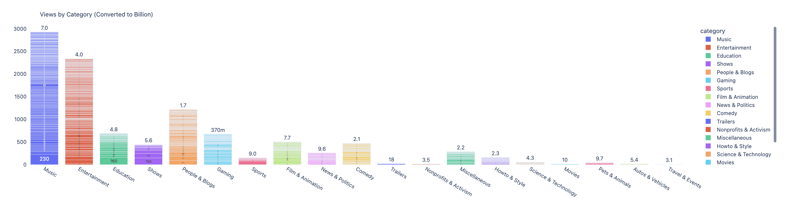
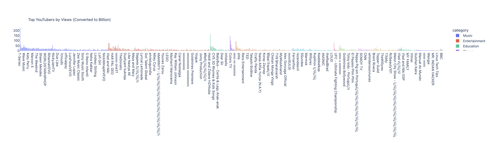
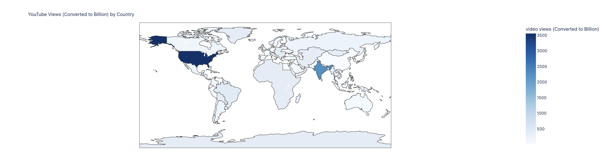
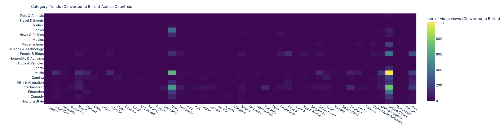
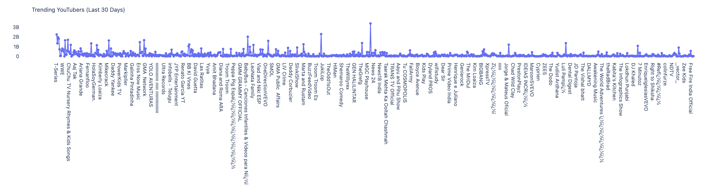
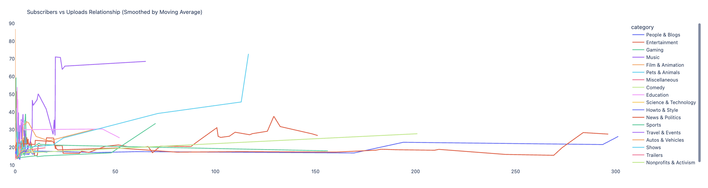

# **YouTube Global Statistics Analytics**

## **Overview**

**A Data Visualization, interactive web application project using Plotly, Preswald, Python, and Pandas** to analyze **global YouTube trends** across **categories, creators, and countries**. Enabling **dynamic exploration** through **interactive insights** using **Global YouTube Statistics 2023** dataset.
---

The application includes **six interactive visualizations** and **a slider-based filter** for dynamic exploration.

## **Author & Dataset**
- **Author:** Sweta Pati  
- **Email:** spati@gmu.edu  
- **University:** George Mason University  
- **Dataset:** [Global YouTube Statistics 2023](https://www.kaggle.com/datasets/nelgiriyewithana/global-youtube-statistics-2023?resource=download)  
- **Live Deployed Preview Link:** [Preview](https://my-example-project-514006-3h0rzgww-ndjz2ws6la-ue.a.run.app) 
- **Demo Video Link:** [Video](https://drive.google.com/file/d/1dIltYoPJXD8v64u2FJ1dohb0a2Vnw4o0/view?usp=sharing) 
---

## **Features**
### **Global Filter - Slider for Views Threshold**
Before displaying the visualizations, the application features a **slider-based filter** that allows users to adjust the **minimum number of video views (in billions)** required for a category, creator, or country to appear in the plots. This enhances interactivity by dynamically filtering the dataset.

```python
views_threshold = slider("Minimum Views (Converted to Billion)", min_val=0, max_val=max_views, default=0.5)
```

Once a threshold is selected, **six different visualizations** are displayed.

---

## **Visualizations: Interactive Data Insights**

This section highlights six key **visualizations** from the YouTube Global Statistics Analytics project, enabling insights into **category trends, top YouTubers, regional viewership, and subscriber growth patterns**.

### **1. Views by Category (Bar Chart)**
**Graph Type:** 📊 **Bar Chart (Categorical Comparison)**  
- Displays **total YouTube video views** across **different content categories**.
- Users can **identify top-performing and niche categories**.

<div class="row justify-content-sm-center">
    <div class="col-sm mt-3 mt-md-0">
        
    </div>
</div>

**Insights:**  
- **Most popular category**: **Music**, accumulating **2928.88 billion** views.  
- **Least popular categories**: **Travel & Events, Movies, Nonprofits & Activism**, indicating **niche audience engagement**.

---

### **2. Top YouTubers by Views (Bar Chart)**
**Graph Type:** 📊 **Bar Chart (Ranked List)**  
- Highlights **top YouTubers** ranked by **total video views**.

<div class="row justify-content-sm-center">
    <div class="col-sm mt-3 mt-md-0">
        
    </div>
</div>

**Insights:**   
- **Most-watched YouTuber**: **T-Series**, amassing **228.00 billion** views.  
- **Entertainment, Music, and Gaming** dominate the platform, outperforming **educational & niche content**.

---

### **3. YouTube Views by Country (Choropleth Map)**
**Graph Type:** 🌍 **Choropleth Map (Geographical Data Representation)**  
- Displays **YouTube viewership per country**, showcasing regional engagement trends.

<div class="row justify-content-sm-center">
    <div class="col-sm mt-3 mt-md-0">
        
    </div>
</div>

**Insights:**  
- **Highest YouTube engagement**: **United States**, leading with **3557.44 billion** views.  
- **Lowest engagement regions**: **Peru, Finland, Andorra**, potentially due to **lower internet penetration & population size**.

---

### **4. Category Trends Across Countries (Heatmap)**
**Graph Type:** 🔥 **Heatmap (Regional Comparison)**  
- Illustrates **YouTube category trends** across **different countries**.

<div class="row justify-content-sm-center">
    <div class="col-sm mt-3 mt-md-0">
        
    </div>
</div>

**Insights:**  
- **United States** dominates global views with **3557.44 billion** views, with **Music** as the leading category.  
- **Least-watched categories globally**: **Travel & Events, Movies, Nonprofits & Activism**, catering to niche audiences.

---

### **5. Trending YouTubers (Last 30 Days) (Line Chart)**
**Graph Type:** 📈 **Line Chart (Time Series Analysis)**  
- Tracks **YouTube creators trending in the last 30 days**, showcasing engagement fluctuations.

<div class="row justify-content-sm-center">
    <div class="col-sm mt-3 mt-md-0">
        
    </div>
</div>

**Insights:**   
- **Most trending YouTuber**: **ıııııııı KIMPRO**, accumulating **3.4 billion** views in the last month.  
- **Largest drop in engagement**: **ArianaGrandeVevo**, indicating possible audience shifts or content changes.

---

### **6. Subscribers vs Uploads Growth (Multi-Line Chart)**
**Graph Type:** 📈 **Multi-Line Chart (Trend Comparison)**  
- Analyzes **content uploads & subscriber growth trends** across categories.

<div class="row justify-content-sm-center">
    <div class="col-sm mt-3 mt-md-0">
        
    </div>
</div>

**Insights:**  
- **Highest subscriber growth**: **Film & Animation**, reaching **86.90 million** subscribers.  
- **Lowest subscriber growth**: **Travel & Events**, with only **12.50 million** subscribers.  
- **Quality content > Upload quantity** – not all categories gain subscribers at the same rate.

---

## **How to Run the Application**
### **1. Install Preswald**
Ensure you have **Preswald** installed. If not, install it using:

```bash
pip install preswald
```

### **2. Set Up Your Project**
Initialize your **Preswald project** and navigate to it:

```bash
preswald init my_example_project
cd my_example_project
```

### **3. Download the Dataset**
Place your dataset in the **data/** folder inside your project, after downloading the data through the Kaggle link provided above.

### **4. Run the Application Locally**
Execute the following command in your project directory:

```bash
preswald run
```

### **5. Deploy to Structured Cloud**
Once you're happy with your app, **deploy it online**:

1. Get an API key from [Preswald Structured Cloud](https://app.preswald.com)
2. Run the deployment command:

```bash
preswald deploy --target structured --github <your-github-username> --api-key <structured-api-key> hello.py
```

Replace `<your-github-username>` and `<structured-api-key>` with your credentials.

3. Open the **live preview link** provided after deployment.

This interactive app provides **valuable insights** into **global YouTube trends**. It enables **creators, analysts, and marketers** to explore data dynamically through **interactive filters and charts**.


